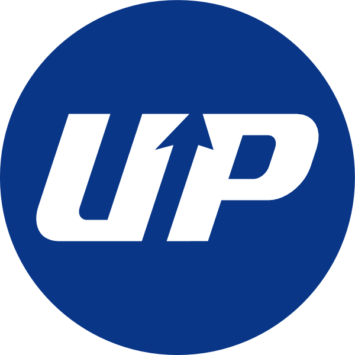
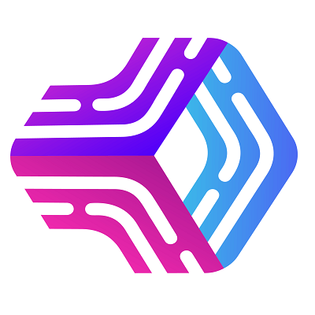
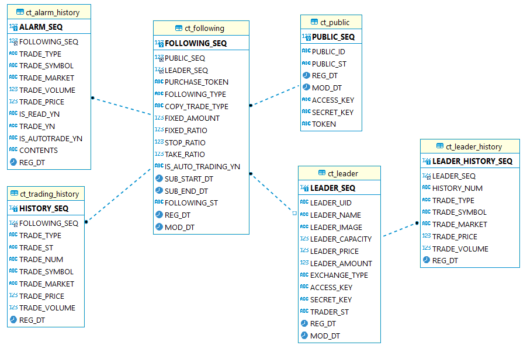

# 프로젝트 소개
한국공학대학교 2023년 졸업작품 S2-12팀 휴먼리더 카피트레이딩 프로젝트입니다.

해당 프로젝트에서는 Upbit api를 이용하여 리더로 등록된 계좌를 모니터링 한 후, 리더를 구독한 사용자들에게 카피트레이딩 기능을 제공합니다.
*카피 트레이딩: 다른 트레이더들의 거래를 카피(복제)하는 것을 포함한 특별한 유형의 거래 활동을 말한다. 

# 팀원
|김충오|김진유|서지원|
|:---:|:---:|:---:|
|팀장 앱 프론트엔드|monitoring 서버 trading 서버|main 서버 admin 서버|

# 기술 스택
## monitoring 서버, trading 서버
|Node.js|MariaDB|express|Upbit API|
|---|---|---|---|
|||||
## main 서버
|nodejs|express|pm2|mariaDB|swagger|
|---|---|---|---|---|
||||||
## admin 서버
|nodejs|reactjs|react-Router| 
|---|---|---|
||||
## 앱 프론트엔드
|JavaScript|React Native|CSS|
|---|---|---|
||||
# 아키텍처 구성도

# DB 구성도

